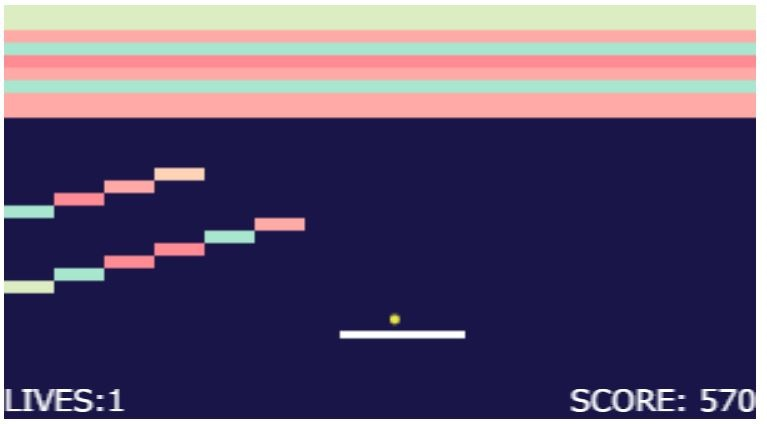
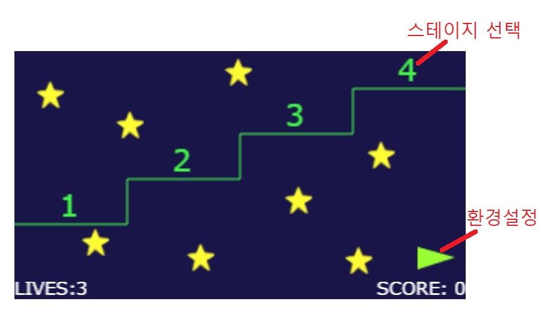
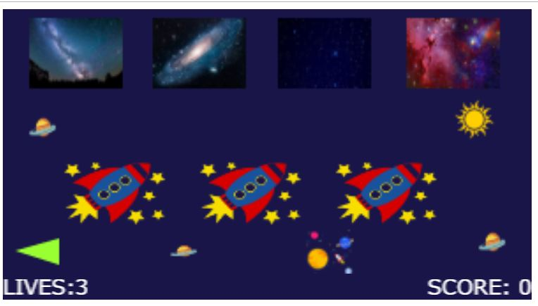
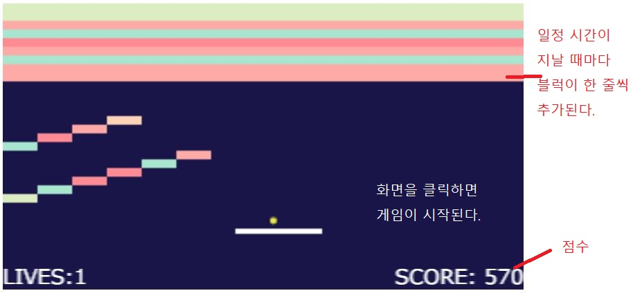

# Brick_out

## Intro

서기 2120년. 당신은 패키지 우주여행을 떠났다가 그만 우주 미아가 되어버렸다.

지구로 돌아가려 하지만 블럭들이 앞을 막고 있는데...

블럭들을 부숴서 집으로 돌아가는 길을 뚫자!

 

 
 

## INSTALLATION

`Brick Out`은 웹 기반으로 동작하는 게임입니다. 

 따라서, 별도의 설치 과정은 필요가 없으나 브라우저에 따라 게임이 최적화되지 않을 수 있습니다.
 
 만약 게임이 제대로 실행되지 않는다면, 브라우저의 캐시를 삭제 후 다시 시도해 주십시오.

 

**권장 사양:**

- Chrome browser 최신 버전 (74.0.3729.169)
- 데스크탑 혹은 랩탑. (모바일 X)

게임은 `brickout.html`을 실행하시거나, 아래의 링크를 클릭하시면 됩니다.

#### [**[GAME START]**](<https://sunmon.github.io/Brick_out/brickout.html>)

 

 

## GUIDE

총 네 개의 스테이지가 있습니다. 각 스테이지를 클리어하면 자동으로 다음 스테이지로 넘어갑니다.

4번째 스테이지 클리어시, 게임 클리어가 됩니다.

기본으로 3개의 목숨이 주어지며, 모든 목숨을 소진 시 게임 오버가 됩니다. 게임 오버 후에 해당 스테이지부터 다시 시작하거나, 스테이지를 다시 선택 할 수 있습니다. 목숨은 아이템을 통해 늘릴 수 있습니다.

벽돌을 깨면 점수를 획득합니다. 벽돌 색에 따라 점수가 다릅니다.

 

 

### Screen description

**스테이지 선택**

 

**환경설정**

 

**게임 화면**

 
 

### Items

| 아이템                                     | 설명                                     |
| ------------------------------------------ | ---------------------------------------- |
|       | 목숨을 하나 늘린다.                      |
|         | 새 공을 한 개 추가한다.                  |
|   | 맨 위 블럭 한 줄을 삭제한다.             |
|        | 바의 길이를 늘린다.                      |
|  | 일정 시간 동안 접촉하는 모든 벽돌을 깬다 |
|                                            |                                          |

## Document

`brickout.html`

- 기본 html 파일. 이 파일로 게임을 실행하시면 됩니다.

`brickout.css`

- 디자인 관련한 css 파일.

`brickout.js`

- 메인 자바스크립트 파일.

`./assets` 

- 게임과 문서에 들어가는 이미지들을 모아놓은 폴더

`./docs`

- 게임을 만드는 데 필요했던 문서들 모음
- 초기 설계도, 기획서
- 새롭게 알게 된 개념 & 메소드들을 작성해 둔 Reference.md

 
 

## Contributors

컴퓨터공학과 김선정

스마트ICT융합공학과 장지영

 

 

## Extra

jquery를 이용한 버전도 차후 업데이트 할 예정입니다.

git repository : [https://github.com/Sunmon/Brick_out](https://github.com/Sunmon/Brick_out)

BRICK OUT : [https://sunmon.github.io/Brick_out](https://sunmon.github.io/Brick_out)

BRICK OUT 게임 링크: [https://sunmon.github.io/Brick_out/brickout.html](https://sunmon.github.io/Brick_out/brickout.html)
