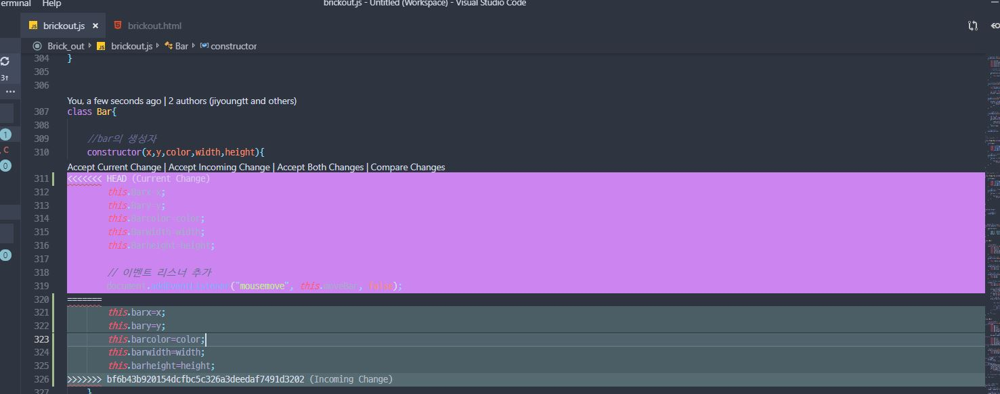

# Reference

### 0. Module

**MOUDLE 오류나서 버렸다. js 파일 하나로 합침**

C++의 include / java의 import처럼 js에도 module이라는 개념이 있다.

일단 해 보고, 안 되면 하나로 합치지 뭐

[자바스크립트 ES6 모듈 내보내기/ 불러오기](http://www.daleseo.com/js-module-import/)

[자바스크립트 모듈 사용하기](https://jeong-pro.tistory.com/122)

[#자바스크립트에서의 import](https://asfirstalways.tistory.com/236)

[Class vs Module](https://medium.com/@darrion/javascript-es6-classes-modules-c5169555317d)

[Module](https://poiemaweb.com/es6-module) //여기 설명 잘 되어있다!

 

:Warning:

module썼더니 import시 `Unexpected Idenfier`에러가 남 ⇒  ``로 붙여줘서 해결

그랬더니 이젠 CORS 문제가 남.. ⇒

Chrome에서 import를 실행할 시, `file://프로토콜`은 오류가 난다고 한다. [해결하려면 웹서버를 써야 한다는데..](https://stackoverflow.com/questions/52343339/javascript-import-module-to-index-html-not-running-due-to-errors) 그냥 module을 포기하기로 했다.

Web security를 꺼서 해결하려고 해도... file:// non-javascript type "" 문제가 난다.
https://stackoverflow.com/questions/3102819/disable-same-origin-policy-in-chrome

https://sunmon.github.io/Brick_out/brickout.html

여기로 들어가보자. 모듈 써도 될 듯. 왜냐면 웹페이지니까

 
 

### 1. Object / Class

Block 객체를 생성하여 이용.

기존에는 사용자 정의 객체를 이용해야 했다.
  
  
 

사용자 정의 객체 설명: 

http://steadypost.net/post/lecture/id/13/

http://insanehong.kr/post/javascript-object/
  
 
  
  
ES6부터는 자바스크립트에서도 Class를 지원한다. 따라서 Class를 이용하여 block 객체들을 생성한다.

https://developer.mozilla.org/ko/docs/Web/JavaScript/Reference/Classes

https://infoscis.github.io/2018/02/13/ecmascript-6-introducing-javascript-classes/

https://medium.com/sjk5766/ecma-script-es-%EC%A0%95%EB%A6%AC%EC%99%80-%EB%B2%84%EC%A0%84%EB%B3%84-%ED%8A%B9%EC%A7%95-77715f696dcb

https://poiemaweb.com/es6-class

https://developer.mozilla.org/ko/docs/Web/JavaScript/Reference/Classes#Class_%EC%A0%95%EC%9D%98

 
 

## 2. 2차원 배열

[다차원 배열 만들기](https://smilerici.tistory.com/71)

[화살표 함수](https://smilerici.tistory.com/56?category=714049)

[initialize array](https://stackoverflow.com/questions/4852017/how-to-initialize-an-arrays-length-in-javascript)

 
 

## 3. forEach 문

[자바스크립트 배열 메소드 foreach / map](https://medium.com/@hongkevin/js-1-%EC%9E%90%EB%B0%94%EC%8A%A4%ED%81%AC%EB%A6%BD%ED%8A%B8-%EB%B0%B0%EC%97%B4-%EB%A9%94%EC%84%9C%EB%93%9C-1-foreach-map-b1cb1c2237d1)

[foreach Reference](https://developer.mozilla.org/ko/docs/Web/JavaScript/Reference/Global_Objects/Array/forEach)
 
 

## 4. 상속

OOP답게 상속이 있다. Stage를 Stage1, Stage2, Stage3... 상속해주자.

[상속과 프로토타입](https://developer.mozilla.org/ko/docs/Web/JavaScript/Guide/Inheritance_and_the_prototype_chain)

 
 
 

## 5. map(),  some()문

[Array 객체에서 놓치지 말아야 할 것](https://programmingsummaries.tistory.com/357)

충돌 검사 / 게임 오버 검사시 some문 쓰면 좋을 것 같다.

 
 

## 6. typescript

자바스크립트에는 타입이 없다. 그래서 오류가 나는데 안 잡아준다.

parameter 개수 달라서 함수 실행이 제대로 안 되는데 왜 안 잡아줘? 왜 디버그 안 해줘?

화난다

그래서 알게 된 게 typescript. 기존 다른 언어들처럼 형을 지정해준다

[typescript](https://poiemaweb.com/typescript-introduction)

 
 

## 7. Object.entries() :: pair

js에는 pair가 없다. 대신 비슷한 기능이 있다. `Object.entires()`라고.

https://developer.mozilla.org/ko/docs/Web/JavaScript/Reference/Global_Objects/Object/entries

pair대신 array로 리턴해준다.

 
 

## 좋은 사이트

웹 프로그래밍 잘 알려주는 사이트 (강추): https://poiemaweb.com/

[자바스크립트 흔한 오류 TOP 10](https://blog.meeta.io/10)

 
 

## conflict

conflict 난 사진

이럴 때 잘 보고 원하는 코드로 Accept하면 된다.

Current change: 내가 짠 거

Incomming: pull해서 불러 온 것

Both : 둘 다 냅두기

Compare: 비교하는거

한 줄씩 적용하는 기능이 있던 것 같은데, sublime text에도 있는지 모르겠다.

 
 

### icon

화살표:

Icons made by <a href="https://www.freepik.com/" title="Freepik">Freepik</a> from <a href="https://www.flaticon.com/" 			    title="Flaticon">www.flaticon.com</a> is licensed by <a href="http://creativecommons.org/licenses/by/3.0/" 			    title="Creative Commons BY 3.0" target="_blank">CC 3.0 BY</a>

+:

Icons made by <a href="https://www.flaticon.com/authors/hanan" title="Hanan">Hanan</a> from <a href="https://www.flaticon.com/" 			    title="Flaticon">www.flaticon.com</a> is licensed by <a href="http://creativecommons.org/licenses/by/3.0/" 			    title="Creative Commons BY 3.0" target="_blank">CC 3.0 BY</a>

-:

Icons made by <a href="https://www.flaticon.com/authors/hanan" title="Hanan">Hanan</a> from <a href="https://www.flaticon.com/" 			    title="Flaticon">www.flaticon.com</a> is licensed by <a href="http://creativecommons.org/licenses/by/3.0/" 			    title="Creative Commons BY 3.0" target="_blank">CC 3.0 BY</a>

♡:

Icons made by <a href="https://www.freepik.com/" title="Freepik">Freepik</a> from <a href="https://www.flaticon.com/" 			    title="Flaticon">www.flaticon.com</a> is licensed by <a href="http://creativecommons.org/licenses/by/3.0/" 			    title="Creative Commons BY 3.0" target="_blank">CC 3.0 BY</a>

electric:

Icons made by <a href="https://www.flaticon.com/authors/smashicons" title="Smashicons">Smashicons</a> from <a href="https://www.flaticon.com/" 			    title="Flaticon">www.flaticon.com</a> is licensed by <a href="http://creativecommons.org/licenses/by/3.0/" 			    title="Creative Commons BY 3.0" target="_blank">CC 3.0 BY</a>

 
 

### 블럭깨기 

https://developer.mozilla.org/ko/docs/Games/Tutorials/%EC%88%9C%EC%88%98%ED%95%9C_%EC%9E%90%EB%B0%94%EC%8A%A4%ED%81%AC%EB%A6%BD%ED%8A%B8%EB%A5%BC_%EC%9D%B4%EC%9A%A9%ED%95%9C_2D_%EB%B2%BD%EB%8F%8C%EA%B9%A8%EA%B8%B0_%EA%B2%8C%EC%9E%84
